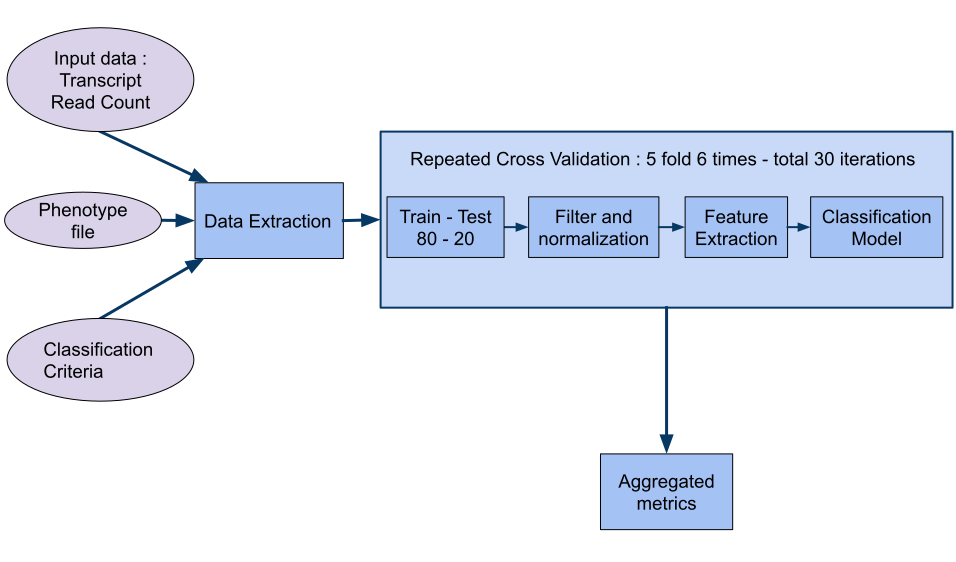

# Feature Extraction Methods for cancer-diagnosis using blood-based biomarkers : A benchmarking study

## Problem 
Compare feature extraction methods for binary classification of cancer types and subtypes using blood-based biomarkers.

### Approach
Build a generic pipeline to run any biomarker dataset on multiple feature extraction methods and classification models

### Type of data used
* microRNAs from Extra Cellular Vesicles
* Total RNA from Tumour Educated Platelets

### Pipeline

### Code & Directory Structure
*  : starting point to call pipeline
*  : list of datasets and its meta-data, used by pipeline_executor.R as arguments to call pipeline
*  : list of feature extraction methods run in the pipeline
* katana_scripts/ : scripts to call pipeline_executor.R in Katana computational cluster
* data/ : contains source data, extracted data and preprocessed data
* phenotype_info/ : contains currently used phenotype files and the script used in some steps of phenotype file creation
* data_extraction/ : data extraction step in the pipeline
* preprocessing/ : filtering and normalization preprocessing steps
* feature_extraction/ : contains functions for Feature Extraction Method step in pipeline
* classification_models/ : contains functions for classification model step in pipeline
* metrics/ : compute evaluation metrics for a particular sample
* utils/ : common utility functions
* helper.R : write results to file
* results_processing/ : scripts to generate plots from results, statistically analyze results, compute pairwise Jaccard Index, combine results, analyze results specifically of that of Ranger feature selection method
* install.R : list of packages to be installed to run this pipeline
